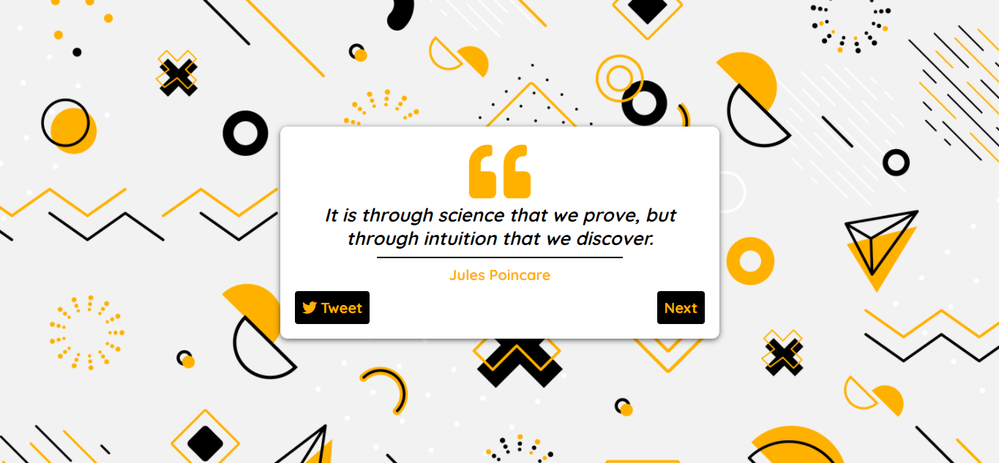

# Random Quote Generator

<p align="center">
  
</p>

A small web app that shows a random inspirational quote and lets you share it on Twitter.

**Live demo:** https://randomquote-app.vercel.app/

## Features
- Fetches a random quote on load and on every click of **Next**
- One-click sharing of the current quote to Twitter
- Friendly message if the quote service can't be reached

## Tools used : 
- HTML
- CSS
- JS
- [DummyJSON Quotes API](https://dummyjson.com/docs/quotes)

## Run locally
No build step or dependencies are needed. Clone the repo and open `index.html` in a browser, or serve the folder with any static server, for example:

```bash
npx serve .
# or
python3 -m http.server 8000
```

## YouTube Video Link
https://www.youtube.com/watch?v=aXiWcnWYzds&t=2s

#### Don't forget to subscribe 
